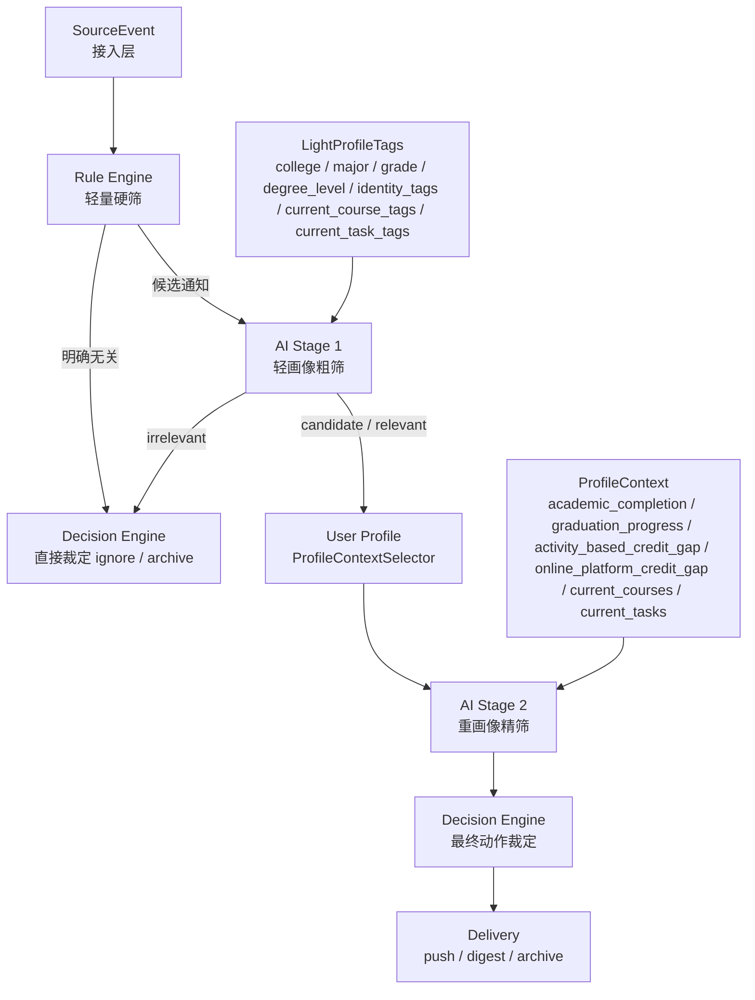
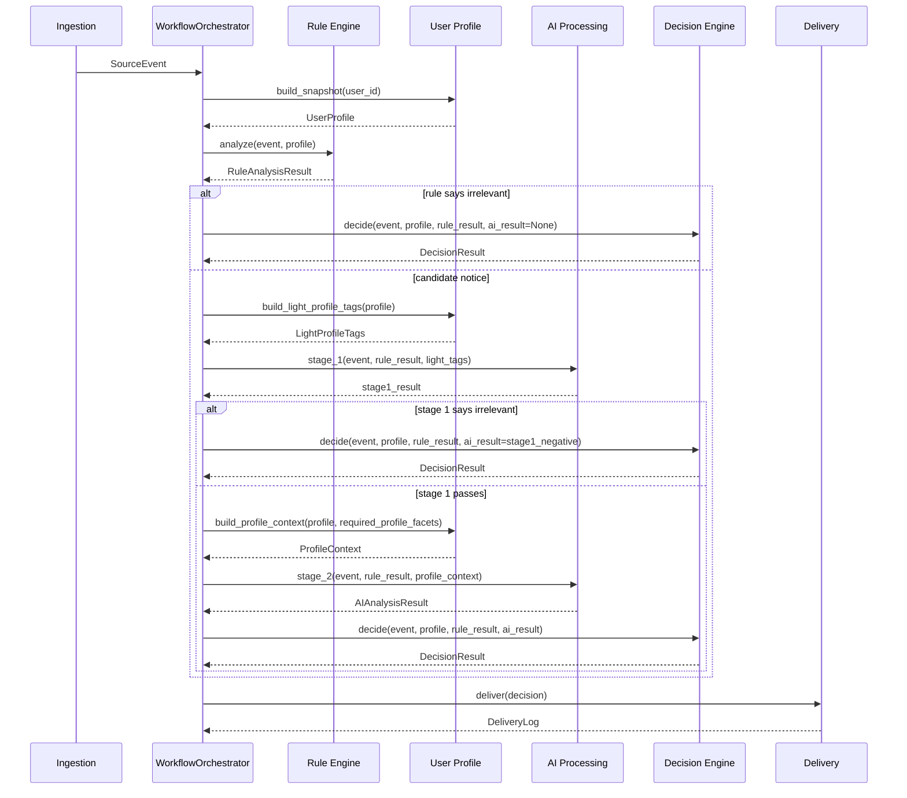

# 08_current_phase_personal_tool_architecture.md

## 1. 文档目的

本文档用于冻结 **当前阶段（个人单用户工具阶段）** 的通知相关性筛选架构。

它不是长期平台化架构的替代品，而是对当前现实约束的明确收口：

- 当前系统主要服务 **单个真实用户**
- 当前重点是 **判断质量**，不是 **多用户扩展**
- 当前重点是 **低维护成本**，不是 **复杂路由优化**
- 当前重点是 **避免规则误杀**，不是把 token 压到极限

因此，当前阶段的目标不是构建“消息级路由 + 候选用户池 + 多阶段人群分发”，而是构建一条 **适合个人小工具** 的最简主链路。

---

## 2. 当前阶段的一句话定义

**当前阶段采用“轻规则硬筛 + 轻画像 LLM 粗筛 + 重画像 LLM 精筛 + 决策层统一裁定”的个人工具架构。**

---

## 3. 为什么当前阶段要这样设计

### 3.1 当前不是多用户平台

当前系统没有大规模用户枚举和路由压力，因此没有必要为了未来扩展，提前引入：

- 消息级候选用户群路由
- 复杂的受众分群缓存
- 多阶段消息理解与人群路由图

这些设计在未来可能有价值，但放在当前阶段会带来：

- 实现复杂度上升
- 文档和代码边界变重
- 调试链路变长
- 个人工具场景下收益不明显

### 3.2 规则层的主要价值是节约 token，而不是替代 AI

当前阶段应明确：

- 规则层存在的主要意义是拦掉“明确无关”的通知
- 规则层不应为了省 token，演化成一个重型中文 NLP 系统
- 如果规则层维护成本、误判成本、算力成本高于直接调用 LLM，那么就违背了当前阶段的目标

### 3.3 当前最该避免的是误杀

对于个人工具来说：

- 多看几条通知的 token 成本通常可接受
- 但把真正对自己有用的通知误杀掉，产品体验会非常差

因此当前阶段的原则是：

**宁可多放一些候选通知给 AI 看，也不要让规则层过早排掉复杂机会类通知。**

---

## 4. 当前阶段的总体策略

当前阶段采用两段 LLM、轻规则兜底的策略：

1. 规则层只做非常轻的硬筛
2. LLM 第一阶段只吃简单画像，做便宜的粗筛
3. 只有粗筛通过，才进入第二阶段重画像推理
4. 决策层统一消费规则、AI 和偏好结果

其核心取舍是：

- 用少量规则保证明显无关通知不过度浪费 token
- 用第一阶段 LLM 代替复杂 NLP 规则
- 用第二阶段 LLM 处理真正需要复杂画像的通知

---

## 5. 当前阶段主链路

当前阶段的推荐主链路如下：

1. 接入层生成 `SourceEvent`
2. 编排层读取单用户 `UserProfile`
3. 规则层执行轻量硬筛
4. 如果规则层判定为明确无关，则直接进入决策层结束链路
5. 否则，进入 LLM 第一阶段粗筛
6. 如果 LLM 第一阶段认为值得继续，则构建重画像 `ProfileContext`
7. 进入 LLM 第二阶段精筛
8. 决策层统一输出 `DecisionResult`
9. 发文层执行触达或归档

可以概括为：

`SourceEvent -> Light Rule Filter -> LLM Stage 1 -> ProfileContext -> LLM Stage 2 -> Decision`

---

## 6. 规则层在当前阶段的职责

### 6.1 只做轻量硬筛

规则层在当前阶段只负责这些事情：

- 明确受众硬失配
- 明确身份硬失配
- 明确课程硬失配
- 明确学院/专业/年级硬失配（仅当通知明确限定受众时）
- 动作词、截止时间、来源权威度等结构化信号提取

### 6.2 当前阶段不要让规则层做的事

规则层不应承担：

- 复杂受众理解
- 长文本隐含语义理解
- 创新创业/讲座/通识课这类开放型通知的最终相关性判断
- 培养方案缺口与通知机会之间的复杂推理
- publisher / explicit_audience 的重型 NLP 解析

### 6.3 当前阶段的硬规则

必须冻结的规则是：

- **如果没有明确受众字段排除自己，就不能仅因为学院/专业未命中而一键硬筛**
- `publisher` 只能说明“谁发的”，不能直接说明“发给谁”
- 只有明确受众限制，才允许做学院/专业/身份硬筛

---

## 7. LLM 第一阶段：轻画像粗筛

### 7.1 目标

第一阶段 LLM 不是做最终裁决，而是做：

- 低成本相关性粗筛
- 判断是否值得加载重画像
- 判断后续需要哪些画像 facet

### 7.2 输入

第一阶段 LLM 默认只看：

- 通知标题
- 通知正文
- 来源信息
- 简单画像 tag

建议简单画像 tag 包括：

- `college`
- `major`
- `grade`
- `degree_level`
- `identity_tags`

### 7.3 输出

第一阶段建议输出：

- `relevance_hint_stage1`
  - `irrelevant`
  - `candidate`
  - `relevant`
- `required_profile_facets`
- `reason_summary_stage1`

### 7.4 当前阶段的判定原则

第一阶段应遵守以下原则：

- 没有明确受众排除时，不要轻易判 `irrelevant`
- 对开放型通知，优先保留为 `candidate`
- 只有明确无关或高置信度无关时，才判 `irrelevant`

---

## 8. LLM 第二阶段：重画像精筛

### 8.1 触发条件

只有当第一阶段输出：

- `candidate`
- 或 `relevant`

时，才进入第二阶段。

### 8.2 输入

第二阶段在第一阶段基础上，额外加载重画像 `ProfileContext`。

当前阶段优先加载的重画像包括：

- `academic_completion`
- `graduation_progress`
- `activity_based_credit_gap`
- `online_platform_credit_gap`
- 必要的 `current_courses`
- 必要的 `current_tasks`

### 8.3 目标

第二阶段负责：

- 结合复杂通知内容和复杂画像做最终相关性判断
- 判断通知是否真正值得推送
- 判断通知为什么和当前用户相关或无关

### 8.4 输出

第二阶段建议输出：

- `relevance_hint`
  - `relevant`
  - `irrelevant`
  - `uncertain`
- `summary`
- `normalized_category`
- `urgency_hint`
- `confidence`

---

## 9. 决策层在当前阶段的职责

决策层仍然是唯一最终动作入口。

它在当前阶段负责：

- 消费规则层硬筛结果
- 消费第一阶段和第二阶段 AI 结果
- 消费用户偏好
- 输出最终动作

推荐动作语义：

- 明确相关且有处理价值：`push_now` / `push_high`
- 可能相关但不紧急：`digest`
- 明确无关：`archive` / `ignore`

当前阶段应确保：

- `reason_summary` 反映最终结论，而不是中间态
- `archive` 结果不能再直接写成“与你可能相关”

---

## 10. 当前阶段的成本原则

### 10.1 优先降低规则维护成本

当前阶段比起节约每一分 token，更重要的是：

- 不要让规则层变成高维护成本系统
- 不要让本地 NLP 推理引入额外模型运维成本

### 10.2 第一阶段 LLM 的主要作用是节约第二阶段成本

当前阶段的成本优化重点不是“尽量少调 LLM”，而是：

- 避免把重画像一股脑全部喂给所有通知
- 让第一阶段先决定是否值得上传复杂画像

因此当前阶段的成本优化顺序是：

1. 轻规则拦掉明确无关
2. 第一阶段 LLM 过滤不值得加载重画像的通知
3. 第二阶段 LLM 只处理剩余候选通知

### 10.3 当前阶段不推荐做的优化

暂不推荐：

- 引入重型中文 NLP 本地模型做 publisher / audience 解析主链路
- 为多用户路由提前做消息级人群分桶
- 为了省 token 在规则层堆过多复杂逻辑

---

## 11. 与未来架构的关系

当前阶段方案是 **阶段性最优方案**，不是最终平台化形态。

未来如果系统从“个人工具”演进到“多用户平台”，再考虑升级为：

- 消息级受众路由
- 候选用户池
- 单消息一次 LLM 路由
- 用户级二阶段精筛

但在当前阶段，不应为了这些未来能力过度设计。

---

## 12. 一句话结论

**当前阶段最合理的架构，不是让规则层承担复杂语义理解，而是让规则层保持便宜和克制，用第一阶段 LLM 做轻画像粗筛，再用第二阶段 LLM 结合重画像做最终相关性判断。**

---

## 13. 模块责任图

## 14. 调用顺序图

